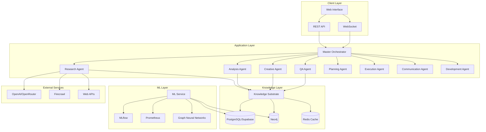
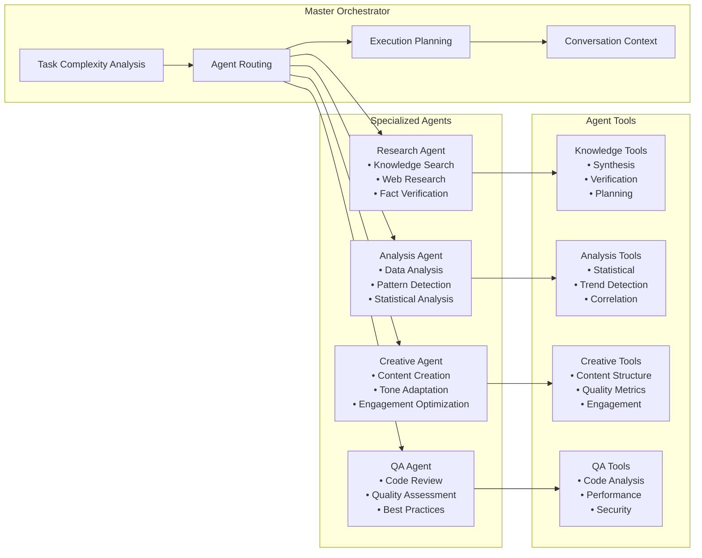
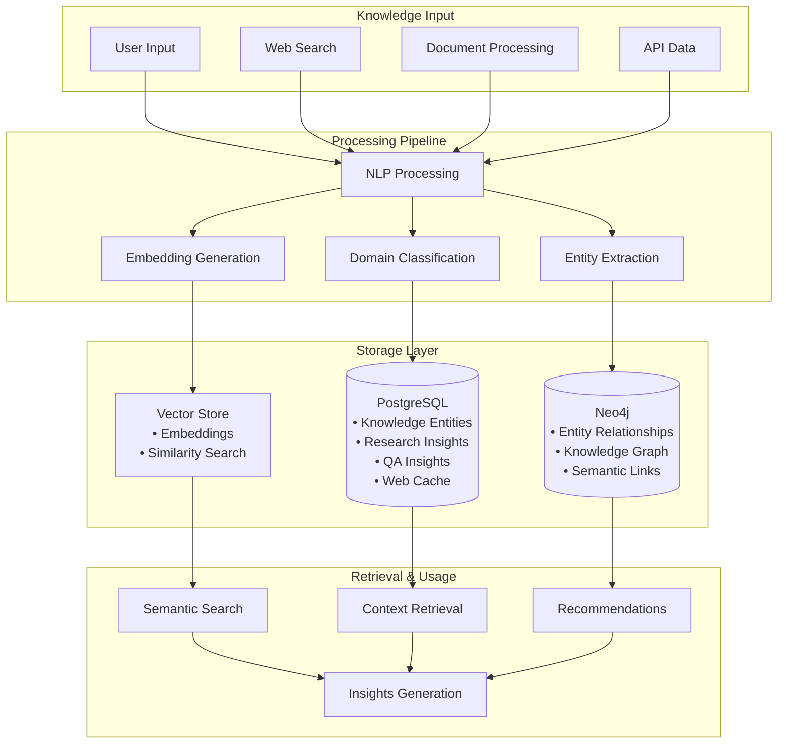
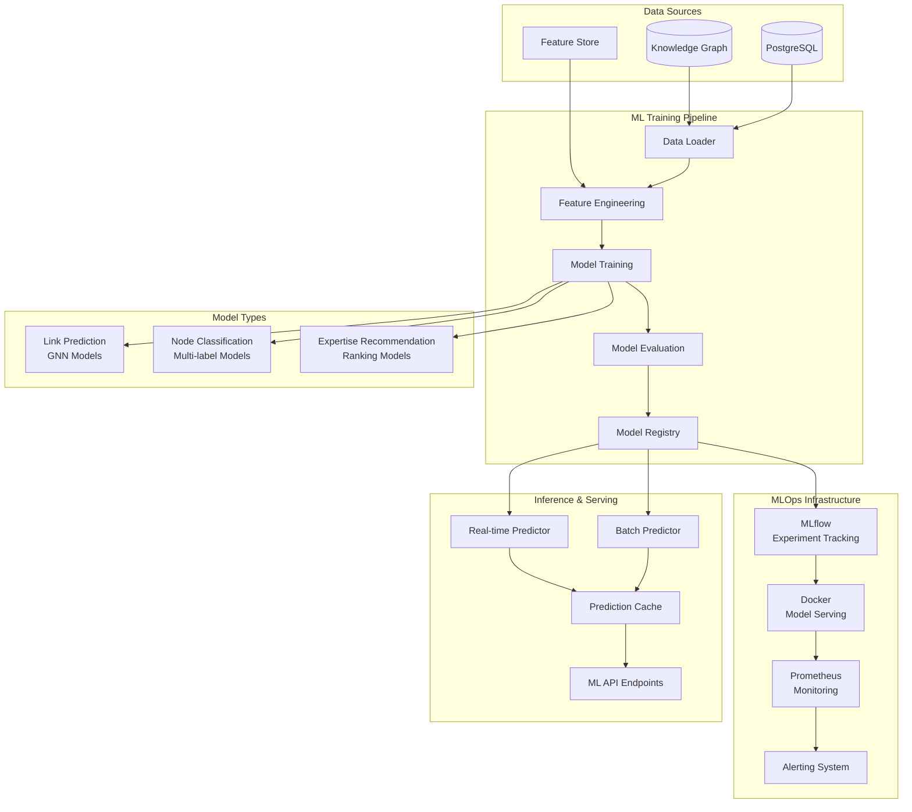
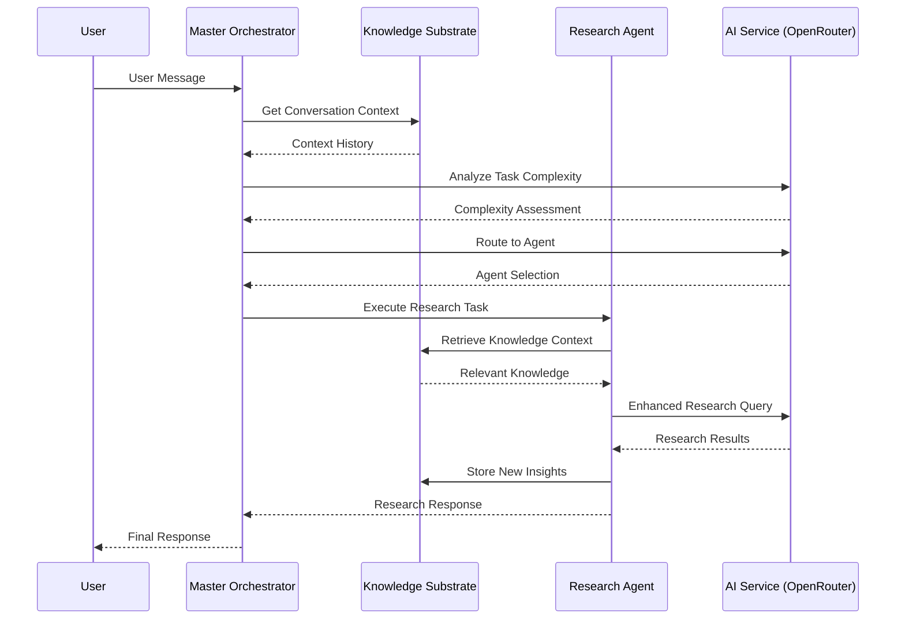

# AthenAI Knowledge Substrate & MLOps Platform

## Table of Contents
- [Overview](#overview)
- [Architecture](#architecture)
- [Component Diagrams](#component-diagrams)
- [Agent System](#agent-system)
- [Knowledge Substrate](#knowledge-substrate)
- [ML & MLOps Pipeline](#ml--mlops-pipeline)
- [Configuration](#configuration)
- [Setup & Deployment](#setup--deployment)
- [Monitoring & Maintenance](#monitoring--maintenance)
- [API Reference](#api-reference)

## Overview

AthenAI is an enterprise-grade AI platform that combines multi-agent orchestration, knowledge substrate management, and MLOps capabilities. The system provides intelligent conversation handling, continuous learning, and automated model lifecycle management.

### Key Features
- **Multi-Agent Orchestration**: Intelligent routing and coordination of specialized AI agents
- **Knowledge Substrate**: Persistent learning with PostgreSQL, Neo4j, and vector embeddings
- **MLOps Pipeline**: Automated training, deployment, and monitoring of ML models
- **Real-time Processing**: WebSocket-based chat with progress broadcasting
- **Continuous Learning**: Knowledge accumulation and reuse across sessions

## Architecture

### System Overview


## Component Diagrams

### Agent Architecture


### Knowledge Substrate Flow


### ML Pipeline Architecture


## Agent System

### Master Orchestrator
The central coordination hub that:
- Analyzes task complexity using AI-powered semantic understanding
- Routes messages to appropriate specialized agents
- Creates execution plans with conversation context
- Manages fallback mechanisms and error handling

### Specialized Agents

#### Research Agent
- **Purpose**: Knowledge discovery and research
- **Tools**: Web search, knowledge synthesis, fact verification
- **Integration**: Firecrawl API, knowledge substrate, web search cache
- **Learning**: Stores research patterns and insights for reuse

#### Analysis Agent
- **Purpose**: Data analysis and pattern detection
- **Tools**: Statistical analysis, trend detection, correlation analysis
- **Capabilities**: GitHub repository analysis, performance metrics
- **Output**: Structured analysis with confidence scoring

#### Creative Agent
- **Purpose**: Content creation and optimization
- **Tools**: Content structuring, tone adaptation, engagement optimization
- **Features**: Quality metrics, audience targeting, creative synthesis

#### Quality Assurance Agent
- **Purpose**: Code review and quality assessment
- **Tools**: Code analysis, security scanning, performance evaluation
- **Standards**: Best practices enforcement, improvement recommendations

### Agent Communication Flow


## Knowledge Substrate

### Database Architecture

#### PostgreSQL (Supabase) Tables
- **knowledge_entities**: Core knowledge storage with vector embeddings
- **research_insights**: Research patterns and findings with domain classification
- **qa_insights**: Quality assurance metrics and improvement patterns
- **web_search_cache**: Cached search results with 24-hour expiration
- **knowledge_provenance**: Source tracking and evidence chains
- **knowledge_conflicts**: Conflict detection and resolution

#### Neo4j Graph Schema
- **Entities**: People, organizations, technologies, concepts
- **Documents**: Processed content with metadata
- **Relationships**: Semantic connections and knowledge links
- **ML Nodes**: Predictions, training runs, model registry

### Domain Classification System
- **ai**: Artificial intelligence, machine learning, neural networks
- **software**: Programming, development, code repositories
- **security**: Cybersecurity, vulnerabilities, authentication
- **performance**: Optimization, scalability, benchmarking
- **data**: Data analysis, databases, data processing
- **api**: API development, endpoints, web services
- **general**: Default classification for unmatched content

### Knowledge Operations

#### Storage Pattern
```javascript
// Enhanced knowledge storage with provenance
await knowledgeSubstrate.storeKnowledge({
  content: "AI model performance improves with larger datasets",
  entityType: "research_finding",
  domain: "ai",
  confidence: 0.92,
  source: "research_session_123",
  provenance: {
    agent: "ResearchAgent",
    evidence: "Multiple academic papers and benchmarks",
    sessionId: "session_456"
  },
  patterns: ["performance_scaling", "dataset_size_correlation"]
});
```

#### Retrieval Pattern
```javascript
// Multi-tier knowledge retrieval
const knowledge = await knowledgeSubstrate.retrieveContext({
  query: "machine learning performance optimization",
  domain: "ai",
  limit: 10,
  includeSemanticSimilarity: true,
  confidenceThreshold: 0.7
});
```

## ML & MLOps Pipeline

### Model Architecture

#### Graph Neural Networks
- **Link Prediction**: Predicts relationships between entities
- **Node Classification**: Classifies documents and entities
- **Expertise Recommendation**: Matches experts to domains

#### Model Types
```python
# Link Prediction GNN
class LinkPredictionGNN(torch.nn.Module):
    def __init__(self, input_dim, hidden_dim, num_layers):
        super().__init__()
        self.gnn_layers = torch.nn.ModuleList([
            GCNConv(input_dim if i == 0 else hidden_dim, hidden_dim)
            for i in range(num_layers)
        ])
        self.classifier = torch.nn.Linear(hidden_dim * 2, 1)
    
    def forward(self, x, edge_index, edge_pairs):
        # GNN forward pass with edge prediction
        pass
```

### MLOps Workflow

#### Training Pipeline
1. **Data Extraction**: Neo4j → PyTorch Geometric conversion
2. **Feature Engineering**: Node/edge feature creation
3. **Model Training**: Multi-GPU training with early stopping
4. **Evaluation**: Comprehensive metrics (AUC, precision, recall)
5. **Model Registry**: MLflow tracking and versioning

#### Deployment Pipeline
1. **Model Validation**: Performance threshold checks
2. **Containerization**: Docker image creation
3. **Serving**: FastAPI endpoints with health checks
4. **Monitoring**: Prometheus metrics and alerting

#### Retraining Triggers
- **Performance Degradation**: Accuracy drops below threshold
- **Data Drift**: Distribution changes detected
- **Scheduled**: Regular retraining intervals
- **Manual**: Operator-initiated retraining

### ML Service Components

#### Real-time Predictor
```python
class RealTimePredictor:
    def __init__(self):
        self.knowledge_first = True  # Check knowledge before ML
        self.model_cache = {}
        self.prediction_cache = {}
    
    async def predict(self, prediction_type, input_data):
        # Knowledge-first approach
        knowledge_result = await self.check_knowledge_substrate(input_data)
        if knowledge_result:
            return knowledge_result
        
        # ML prediction fallback
        return await self.ml_predict(prediction_type, input_data)
```

#### Batch Processor
- **Job Management**: Async processing with progress tracking
- **Scalability**: Configurable batch sizes and parallel processing
- **Error Handling**: Retry logic and failure recovery
- **Output Management**: Results storage and notification

### Model Monitoring

#### Performance Metrics
- **Accuracy Tracking**: Real-time performance monitoring
- **Latency Monitoring**: Inference time tracking
- **Throughput Metrics**: Requests per second
- **Resource Usage**: CPU, memory, GPU utilization

#### Data Drift Detection
- **Statistical Tests**: KS test, chi-square test
- **Distribution Comparison**: Input feature drift
- **Prediction Drift**: Output distribution changes
- **Alerting**: Automated notifications on drift detection

## Configuration

### Environment Variables

#### Core Application
```env
# Server Configuration
PORT=3000
NODE_ENV=production
LOG_LEVEL=info

# AI Services
OPENROUTER_API_KEY=your-openrouter-key
OPENROUTER_MODEL=anthropic/claude-3.5-sonnet
OPENROUTER_TEMPERATURE=0.7
OPENAI_API_KEY=your-openai-key  # Fallback

# Web Services
FIRECRAWL_API_KEY=your-firecrawl-key
```

#### Database Configuration
```env
# Supabase (Primary Database)
SUPABASE_URL=https://your-project.supabase.co
SUPABASE_SERVICE_ROLE_KEY=your-service-role-key
SUPABASE_ANON_KEY=your-anon-key

# Neo4j (Knowledge Graph)
NEO4J_URI=bolt://localhost:7687
NEO4J_USER=neo4j
NEO4J_PASSWORD=your-neo4j-password

# Redis (Caching)
REDIS_URL=redis://localhost:6379
REDIS_PASSWORD=your-redis-password
```

#### ML Service Configuration
```env
# ML Service
ML_SERVICE_ENABLED=true
ML_SERVICE_URL=http://localhost:8001
ML_MODEL_PATH=/app/models
ML_BATCH_SIZE=32
ML_INFERENCE_TIMEOUT=30

# MLflow
MLFLOW_TRACKING_URI=http://localhost:5000
MLFLOW_EXPERIMENT_NAME=athenai-models
MLFLOW_S3_ENDPOINT_URL=your-s3-endpoint

# Monitoring
PROMETHEUS_ENABLED=true
PROMETHEUS_PORT=9090
ALERT_WEBHOOK_URL=your-alert-webhook
```

#### Document Processing
```env
# Unstructured Service
UNSTRUCTURED_API_KEY=your-unstructured-key
UNSTRUCTURED_WORKER_URL=http://unstructured-worker:8080
DOCUMENT_PROCESSING_ENABLED=true
```

### Model Configuration Files

#### Training Configuration (`config/training_config.yaml`)
```yaml
model:
  type: "link_prediction"
  architecture: "gcn"
  hidden_dim: 128
  num_layers: 3
  dropout: 0.2

training:
  epochs: 100
  batch_size: 1024
  learning_rate: 0.001
  early_stopping_patience: 10
  validation_split: 0.2

optimization:
  optimizer: "adam"
  weight_decay: 0.0001
  lr_scheduler: "cosine"
```

#### Deployment Configuration (`config/deployment_config.yaml`)
```yaml
serving:
  model_name: "link_predictor_v1"
  version: "1.0.0"
  batch_size: 32
  max_batch_delay: 100
  timeout: 30

scaling:
  min_replicas: 1
  max_replicas: 5
  cpu_threshold: 70
  memory_threshold: 80

monitoring:
  metrics_enabled: true
  logging_level: "INFO"
  health_check_interval: 30
```

## Setup & Deployment

### Quick Start
```bash
# 1. Clone and install dependencies
git clone <repository>
cd AthenAi
npm install

# 2. Configure environment
cp .env.simplified.example .env
# Edit .env with your API keys and database URLs

# 3. Initialize databases
# PostgreSQL: Run db/postgres/schema.sql in Supabase
# Neo4j: Run db/neo4j/advanced_schema.cypher in Neo4j Browser

# 4. Start the application
npm run dev
```

### Docker Deployment
```bash
# Full stack with ML service
docker-compose -f docker-compose.cloud.yml up -d

# Simplified stack without ML
docker-compose -f docker-compose.simplified.yml up -d
```

### Production Deployment

#### Database Setup
```bash
# PostgreSQL Schema
psql -h your-supabase-host -U postgres -d postgres -f db/postgres/schema.sql

# Neo4j Schema
cypher-shell -u neo4j -p password -f db/neo4j/advanced_schema.cypher

# ML Schema (if using ML service)
psql -h your-supabase-host -U postgres -d postgres -f db/supabase/ml_schema.sql
```

#### Service Configuration
```bash
# Initialize knowledge substrate
./setup-knowledge-substrate.sh

# Setup ML service (optional)
./setup-ml-service.sh

# Start production services
./start-dev.sh --production
```

### Health Checks
```bash
# Application health
curl http://localhost:3000/health

# Database connectivity
curl http://localhost:3000/health/database

# ML service health (if enabled)
curl http://localhost:8001/health
```

## Monitoring & Maintenance

### Application Monitoring

#### Health Endpoints
- `/health` - Overall system health
- `/health/database` - Database connectivity
- `/health/ml` - ML service status
- `/metrics` - Prometheus metrics

#### Key Metrics
- **Request Latency**: API response times
- **Agent Performance**: Success rates and execution times
- **Knowledge Quality**: Confidence scores and usage patterns
- **Cache Hit Rates**: Knowledge and web search cache effectiveness

### Database Maintenance

#### Regular Tasks
```sql
-- Clean expired cache entries
SELECT clean_expired_cache();

-- Update entity importance scores
UPDATE knowledge_entities 
SET importance_score = (
  SELECT COUNT(*) FROM knowledge_provenance 
  WHERE entity_id = knowledge_entities.id
) * 0.1;

-- Archive old insights
DELETE FROM research_insights 
WHERE created_at < NOW() - INTERVAL '90 days'
AND confidence_score < 0.5;
```

#### Performance Optimization
```sql
-- Analyze query performance
EXPLAIN ANALYZE SELECT * FROM knowledge_entities 
WHERE domain = 'ai' AND confidence_score > 0.8;

-- Rebuild vector indexes
REINDEX INDEX idx_knowledge_entities_embedding;

-- Update table statistics
ANALYZE knowledge_entities;
```

### ML Model Monitoring

#### Model Performance Tracking
```python
# Monitor prediction accuracy
accuracy_metrics = ml_monitor.get_model_performance(
    model_name="link_predictor_v1",
    time_range="7d"
)

# Check for data drift
drift_report = ml_monitor.detect_data_drift(
    reference_data=training_data,
    current_data=recent_predictions
)
```

#### Automated Retraining
```python
# Configure retraining triggers
retraining_config = {
    "performance_threshold": 0.85,
    "drift_threshold": 0.1,
    "schedule": "weekly",
    "auto_deploy": True
}
```

### Troubleshooting

#### Common Issues
1. **Agent Timeouts**: Check OpenRouter API limits and network connectivity
2. **Database Connection Failures**: Verify credentials and network access
3. **ML Service Errors**: Check model loading and GPU availability
4. **Cache Misses**: Verify Redis connectivity and key generation

#### Debug Commands
```bash
# Check agent performance
npm run test:agents

# Validate database schema
npm run validate:schema

# Test ML service
curl -X POST http://localhost:8001/predict \
  -H "Content-Type: application/json" \
  -d '{"type": "link_prediction", "data": {...}}'
```

## API Reference

### Knowledge Substrate API

#### Core Operations
```javascript
// Knowledge storage
await knowledgeSubstrate.storeKnowledge(entityData);

// Knowledge retrieval
const results = await knowledgeSubstrate.retrieveContext(query);

// Semantic search
const similar = await knowledgeSubstrate.findSimilar(embedding, limit);
```

### ML Service API

#### Prediction Endpoints
```python
# Real-time prediction
POST /predict
{
  "type": "link_prediction",
  "data": {"entity1": "id1", "entity2": "id2"}
}

# Batch prediction
POST /predict/batch
{
  "type": "node_classification",
  "data": [{"content": "text1"}, {"content": "text2"}]
}
```

#### Model Management
```python
# List available models
GET /models

# Model health check
GET /models/{model_name}/health

# Model metrics
GET /models/{model_name}/metrics
```

For complete API documentation, see the OpenAPI specifications in `/docs/api/`.
