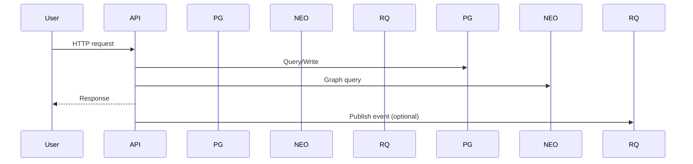
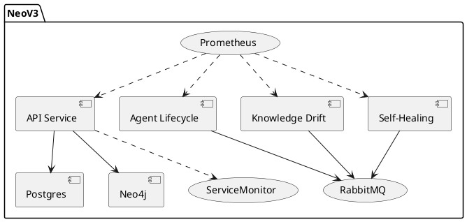

# Architecture Diagrams

## System Component Diagram (Mermaid)
```mermaid
flowchart LR
  subgraph Clients
    U[Users]
    Dev[Developers]
  end

  U -->|HTTP/WS| API
  Dev -->|CI/CD| GH[GitHub Actions]

  subgraph Kubernetes Cluster
    API[API Service]
    ALM[Agent Lifecycle Manager]
    KDD[Knowledge Drift Detector]
    SHM[Self-Healing Monitor]
    RQ[(RabbitMQ)]
    PM[Prometheus Operator]
    GF[Grafana]
  end

  API -->|SQL| PG[(Postgres)]
  API -->|Bolt| NEO[(Neo4j)]

  ALM <-->|AMQP| RQ
  KDD <-->|AMQP| RQ
  SHM <-->|AMQP| RQ

  PM -->|scrape| API
  PM -->|scrape| ALM
  PM -->|scrape| KDD
  PM -->|scrape| SHM
  PM --> GF

  GH -->|kubectl apply -k| Kubernetes Cluster
```

## Request Flow (Mermaid Sequence)


## PlantUML (Component Diagram)


Notes:
- Mermaid renders on GitHub natively.
- PlantUML block can be exported via IDE plugins or CI tools if needed.
