# AthenAI Agent Architecture - Visual Representations

## 1. Overall Agent Ecosystem Architecture

```mermaid
graph TB
    subgraph "User Interface Layer"
        UI[Chat Interface]
        API[REST API Gateway]
        WS[WebSocket Server]
    end
    
    subgraph "Core Orchestration"
        COORD[Enhanced Chat Coordinator<br/>🎯 Main Entry Point]
        MASTER[Master Orchestration Agent<br/>🧠 Task Delegation & Planning]
    end
    
    subgraph "Specialized Agent Layer"
        RESEARCH[Research Agent<br/>🔍 Information Gathering]
        ANALYSIS[Analysis Agent<br/>📊 Data Processing]
        CREATIVE[Creative Agent<br/>🎨 Content Creation]
        TECHNICAL[Technical Agent<br/>⚙️ Code & Development]
        COMM[Communication Agent<br/>📢 External Communications]
        PLANNING[Planning Agent<br/>📋 Project Management]
        QA[Quality Assurance Agent<br/>✅ Testing & Validation]
        EXEC[Execution Agent<br/>🚀 Task Execution]
    end
    
    subgraph "Tool Ecosystem"
        RT[Research Tools<br/>Web Search, Academic Search, Content Analysis]
        AT[Analysis Tools<br/>Data Visualization, Statistical Analysis]
        CT[Creative Tools<br/>Content Generation, Style Management, S3 Storage]
        DT[Development Tools<br/>Code Generation, Deployment, Testing]
        PT[Planning Tools<br/>Resource Allocation, Timeline Optimization]
        QT[QA Tools<br/>Automated Testing, Compliance Checking]
        ET[Execution Tools<br/>Error Recovery, Parallel Processing]
        COMT[Communication Tools<br/>Email Delivery, Social Media]
    end
    
    subgraph "Infrastructure Layer"
        NEO4J[(Neo4j Knowledge Graph<br/>Consciousness Substrate)]
        POSTGRES[(PostgreSQL<br/>Session & Agent Data)]
        RABBITMQ[RabbitMQ<br/>Message Queue]
        REDIS[(Redis Cache)]
    end
    
    subgraph "External Services"
        OPENAI[OpenAI API]
        GOOGLE[Google APIs]
        BING[Bing Search API]
        SCHOLAR[Semantic Scholar]
    end
    
    %% User Interface Connections
    UI --> API
    UI --> WS
    API --> COORD
    WS --> COORD
    
    %% Core Orchestration Flow
    COORD --> MASTER
    MASTER --> RESEARCH
    MASTER --> ANALYSIS
    MASTER --> CREATIVE
    MASTER --> TECHNICAL
    MASTER --> COMM
    MASTER --> PLANNING
    MASTER --> QA
    MASTER --> EXEC
    
    %% Agent-Tool Connections
    RESEARCH --> RT
    ANALYSIS --> AT
    CREATIVE --> CT
    TECHNICAL --> DT
    PLANNING --> PT
    QA --> QT
    EXEC --> ET
    COMM --> COMT
    
    %% Infrastructure Connections
    COORD --> POSTGRES
    MASTER --> NEO4J
    RESEARCH --> NEO4J
    ANALYSIS --> NEO4J
    CREATIVE --> NEO4J
    TECHNICAL --> NEO4J
    
    MASTER --> RABBITMQ
    RESEARCH --> RABBITMQ
    ANALYSIS --> RABBITMQ
    CREATIVE --> RABBITMQ
    TECHNICAL --> RABBITMQ
    
    %% External Service Connections
    RT --> GOOGLE
    RT --> BING
    RT --> SCHOLAR
    RESEARCH --> OPENAI
    ANALYSIS --> OPENAI
    CREATIVE --> OPENAI
    TECHNICAL --> OPENAI
    MASTER --> OPENAI
    
    %% Styling
    classDef userLayer fill:#e1f5fe
    classDef orchestration fill:#f3e5f5
    classDef agents fill:#e8f5e8
    classDef tools fill:#fff3e0
    classDef infrastructure fill:#fce4ec
    classDef external fill:#f1f8e9
    
    class UI,API,WS userLayer
    class COORD,MASTER orchestration
    class RESEARCH,ANALYSIS,CREATIVE,TECHNICAL,COMM,PLANNING,QA,EXEC agents
    class RT,AT,CT,DT,PT,QT,ET,COMT tools
    class NEO4J,POSTGRES,RABBITMQ,REDIS infrastructure
    class OPENAI,GOOGLE,BING,SCHOLAR external
```

## 2. Agent Communication Flow

## 3. Tool Integration Architecture

## 4. Knowledge Graph Integration

## 5. n8n Workflow Execution Pattern

