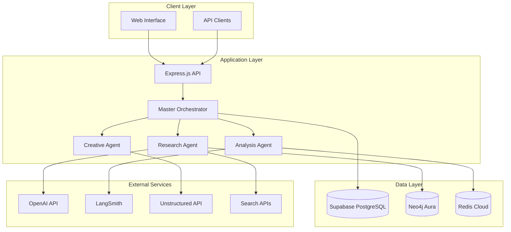

# AthenAI Simplified Implementation Guide for Windsurf IDE

## Overview

This guide provides step-by-step instructions to implement a simplified, cost-optimized AthenAI system using Windsurf IDE, leveraging your 20 years of technical experience. The architecture uses Supabase for managed PostgreSQL, retains Neo4j for knowledge graphs, and Unstructured for document processing.

## Simplified Architecture



## Prerequisites Setup

### 1. Service Accounts Setup

Create accounts for the following services:

```bash
# Required Services
1. Supabase (Free tier: 500MB database, 50MB file storage)
2. Neo4j Aura (Free tier: 200k nodes, 400k relationships)
3. Redis Cloud (Free tier: 30MB)
4. OpenAI API (Pay-per-use)
5. LangSmith (Free tier: 5k traces/month)
6. Unstructured API (Free tier: 1k pages/month)
```

### 2. Environment Variables

Create `.env` file with the following structure:

```env
# Application Configuration
NODE_ENV=development
PORT=3000
APP_NAME=athenai

# Database Configuration
SUPABASE_URL=https://your-project.supabase.co
SUPABASE_ANON_KEY=your-anon-key
SUPABASE_SERVICE_ROLE_KEY=your-service-role-key

# Neo4j Configuration
NEO4J_URI=neo4j+s://your-instance.databases.neo4j.io
NEO4J_USER=neo4j
NEO4J_PASSWORD=your-password

# Redis Configuration
REDIS_URL=redis://your-redis-cloud-url:port

# AI Services
OPENAI_API_KEY=your-openai-key
LANGCHAIN_API_KEY=your-langsmith-key
LANGCHAIN_PROJECT=athenai-production
LANGCHAIN_TRACING_V2=true

# Document Processing
UNSTRUCTURED_API_KEY=your-unstructured-key
UNSTRUCTURED_API_URL=https://api.unstructured.io

# Search APIs (Optional)
SERPAPI_API_KEY=your-serpapi-key
BING_SEARCH_API_KEY=your-bing-key
```

## Windsurf IDE Project Setup

### 1. Initialize Project Structure

```bash
# In Windsurf IDE Terminal
mkdir athenai-simplified
cd athenai-simplified

# Initialize Node.js project
npm init -y

# Install core dependencies
npm install express cors helmet morgan compression
npm install @supabase/supabase-js neo4j-driver redis
npm install @langchain/openai @langchain/core @langchain/community langchain
npm install axios cheerio winston dotenv
npm install --save-dev nodemon jest supertest

# Create project structure
mkdir -p src/{agents,services,routes,middleware,utils,models}
mkdir -p tests/{unit,integration}
mkdir -p docs
```

### 2. Update package.json

```json
{
  "name": "athenai-simplified",
  "version": "1.0.0",
  "description": "Simplified AthenAI implementation with cost optimization",
  "main": "src/app.js",
  "scripts": {
    "start": "node src/app.js",
    "dev": "nodemon src/app.js",
    "test": "jest",
    "test:watch": "jest --watch",
    "test:coverage": "jest --coverage"
  },
  "dependencies": {
    "express": "^4.18.2",
    "cors": "^2.8.5",
    "helmet": "^7.1.0",
    "morgan": "^1.10.0",
    "compression": "^1.7.4",
    "@supabase/supabase-js": "^2.38.0",
    "neo4j-driver": "^5.15.0",
    "redis": "^4.6.10",
    "@langchain/openai": "^0.0.14",
    "@langchain/core": "^0.1.17",
    "@langchain/community": "^0.0.20",
    "langchain": "^0.1.25",
    "axios": "^1.6.0",
    "cheerio": "^1.0.0-rc.12",
    "winston": "^3.11.0",
    "dotenv": "^16.3.1"
  },
  "devDependencies": {
    "nodemon": "^3.0.2",
    "jest": "^29.7.0",
    "supertest": "^6.3.3"
  }
}
```

## Core Implementation

### 1. Application Entry Point

Create `src/app.js`:

```javascript
// src/app.js
require('dotenv').config();
const express = require('express');
const cors = require('cors');
const helmet = require('helmet');
const morgan = require('morgan');
const compression = require('compression');

const { logger } = require('./utils/logger');
const { errorHandler } = require('./middleware/errorHandler');
const { rateLimiter } = require('./middleware/rateLimiter');
const routes = require('./routes');

const app = express();
const PORT = process.env.PORT || 3000;

// Security and performance middleware
app.use(helmet());
app.use(compression());
app.use(cors({
  origin: process.env.NODE_ENV === 'production' 
    ? ['https://your-domain.com'] 
    : ['http://localhost:3000', 'http://localhost:3001']
}));

// Logging
app.use(morgan('combined', { stream: { write: message => logger.info(message.trim()) } }));

// Body parsing
app.use(express.json({ limit: '10mb' }));
app.use(express.urlencoded({ extended: true, limit: '10mb' }));

// Rate limiting
app.use(rateLimiter);

// Health check
app.get('/health', (req, res) => {
  res.json({
    status: 'healthy',
    timestamp: new Date().toISOString(),
    version: process.env.npm_package_version || '1.0.0'
  });
});

// API routes
app.use('/api', routes);

// Error handling
app.use(errorHandler);

// 404 handler
app.use('*', (req, res) => {
  res.status(404).json({ error: 'Route not found' });
});

// Start server
app.listen(PORT, () => {
  logger.info(`AthenAI server running on port ${PORT}`);
});

module.exports = app;
```

### 2. Database Services

Create `src/services/database.js`:

```javascript
// src/services/database.js
const { createClient } = require('@supabase/supabase-js');
const neo4j = require('neo4j-driver');
const redis = require('redis');
const { logger } = require('../utils/logger');

class DatabaseService {
  constructor() {
    this.supabase = null;
    this.neo4jDriver = null;
    this.redisClient = null;
    this.initialized = false;
  }

  async initialize() {
    try {
      // Initialize Supabase
      this.supabase = createClient(
        process.env.SUPABASE_URL,
        process.env.SUPABASE_SERVICE_ROLE_KEY
      );

      // Initialize Neo4j
      this.neo4jDriver = neo4j.driver(
        process.env.NEO4J_URI,
        neo4j.auth.basic(process.env.NEO4J_USER, process.env.NEO4J_PASSWORD)
      );

      // Test Neo4j connection
      const session = this.neo4jDriver.session();
      await session.run('RETURN 1');
      await session.close();

      // Initialize Redis
      this.redisClient = redis.createClient({
        url: process.env.REDIS_URL
      });
      
      this.redisClient.on('error', (err) => {
        logger.error('Redis Client Error', err);
      });
      
      await this.redisClient.connect();

      this.initialized = true;
      logger.info('All database connections initialized successfully');
    } catch (error) {
      logger.error('Database initialization failed:', error);
      throw error;
    }
  }

  // Supabase operations
  async createConversation(sessionId, userId, message, response, agentType, metadata = {}) {
    const { data, error } = await this.supabase
      .from('conversations')
      .insert({
        session_id: sessionId,
        user_id: userId,
        message,
        response,
        agent_type: agentType,
        metadata,
        created_at: new Date().toISOString()
      })
      .select()
      .single();

    if (error) throw error;
    return data;
  }

  async getConversationHistory(sessionId, limit = 10) {
    const { data, error } = await this.supabase
      .from('conversations')
      .select('*')
      .eq('session_id', sessionId)
      .order('created_at', { ascending: false })
      .limit(limit);

    if (error) throw error;
    return data;
  }

  // Neo4j operations
  async createKnowledgeNode(sessionId, orchestrationId, nodeType, properties) {
    const session = this.neo4jDriver.session();
    try {
      const result = await session.run(
        `MERGE (s:Session {id: $sessionId})
         MERGE (o:Orchestration {id: $orchestrationId})
         CREATE (n:${nodeType} $properties)
         MERGE (s)-[:HAS_ORCHESTRATION]->(o)
         MERGE (o)-[:GENERATED]->(n)
         RETURN n`,
        { sessionId, orchestrationId, properties }
      );
      return result.records[0]?.get('n').properties;
    } finally {
      await session.close();
    }
  }

  async queryKnowledge(cypher, parameters = {}) {
    const session = this.neo4jDriver.session();
    try {
      const result = await session.run(cypher, parameters);
      return result.records.map(record => record.toObject());
    } finally {
      await session.close();
    }
  }

  // Redis operations
  async cacheSet(key, value, ttl = 3600) {
    await this.redisClient.setEx(key, ttl, JSON.stringify(value));
  }

  async cacheGet(key) {
    const value = await this.redisClient.get(key);
    return value ? JSON.parse(value) : null;
  }

  async cacheDel(key) {
    await this.redisClient.del(key);
  }

  // Cleanup
  async close() {
    if (this.neo4jDriver) {
      await this.neo4jDriver.close();
    }
    if (this.redisClient) {
      await this.redisClient.quit();
    }
    logger.info('Database connections closed');
  }
}

// Singleton instance
const databaseService = new DatabaseService();

module.exports = { databaseService };
```

### 3. Simplified Agent Implementation

Create `src/agents/MasterOrchestrator.js`:

```javascript
// src/agents/MasterOrchestrator.js
const { ChatOpenAI } = require('@langchain/openai');
const { PromptTemplate } = require('@langchain/core/prompts');
const { logger } = require('../utils/logger');
const { databaseService } = require('../services/database');

class MasterOrchestrator {
  constructor() {
    this.llm = new ChatOpenAI({
      modelName: 'gpt-4',
      temperature: 0.2,
      openAIApiKey: process.env.OPENAI_API_KEY,
      tags: ['master-orchestrator', 'athenai']
    });
  }

  async executeOrchestration(inputData) {
    const startTime = Date.now();
    const sessionId = inputData.sessionId || this.generateSessionId();
    const orchestrationId = this.generateOrchestrationId();
    
    try {
      logger.info('Starting orchestration', { sessionId, orchestrationId });

      // Analyze task complexity
      const complexity = this.analyzeTaskComplexity(inputData.message);
      
      // Determine agent routing
      const routing = this.determineAgentRouting(inputData.message, complexity);
      
      // Create execution plan
      const plan = this.createExecutionPlan(inputData.message, complexity, routing);
      
      // Cache the orchestration context
      await databaseService.cacheSet(
        `orchestration:${orchestrationId}`,
        {
          sessionId,
          message: inputData.message,
          complexity,
          routing,
          plan,
          status: 'in_progress'
        },
        3600 // 1 hour TTL
      );

      // Store in Neo4j knowledge graph
      await databaseService.createKnowledgeNode(
        sessionId,
        orchestrationId,
        'Orchestration',
        {
          message: inputData.message,
          complexity_level: complexity.level,
          primary_agent: routing.primary,
          created_at: new Date().toISOString()
        }
      );

      const executionTime = Date.now() - startTime;
      
      logger.info('Orchestration completed', { 
        sessionId, 
        orchestrationId, 
        executionTime,
        primaryAgent: routing.primary 
      });

      return {
        orchestration_id: orchestrationId,
        session_id: sessionId,
        plan,
        routing,
        complexity,
        execution_time_ms: executionTime,
        status: 'completed'
      };

    } catch (error) {
      logger.error('Orchestration failed', { 
        sessionId, 
        orchestrationId, 
        error: error.message 
      });
      
      return {
        orchestration_id: orchestrationId,
        session_id: sessionId,
        error: error.message,
        status: 'failed'
      };
    }
  }

  analyzeTaskComplexity(message) {
    const indicators = {
      length: message.length,
      questions: (message.match(/\?/g) || []).length,
      technicalTerms: this.countTechnicalTerms(message),
      requestTypes: this.identifyRequestTypes(message)
    };

    let complexityScore = 0;
    
    if (indicators.length > 200) complexityScore += 2;
    else if (indicators.length > 100) complexityScore += 1;
    
    complexityScore += Math.min(indicators.questions * 0.5, 2);
    complexityScore += Math.min(indicators.technicalTerms * 0.3, 2);
    complexityScore += indicators.requestTypes.complexity;

    let level, estimatedDuration, modelToUse;
    if (complexityScore <= 2) {
      level = 'low';
      estimatedDuration = '15s';
      modelToUse = 'gpt-3.5-turbo'; // Cost optimization
    } else if (complexityScore <= 4) {
      level = 'medium';
      estimatedDuration = '30s';
      modelToUse = 'gpt-4';
    } else {
      level = 'high';
      estimatedDuration = '60s';
      modelToUse = 'gpt-4';
    }

    return {
      score: complexityScore,
      level,
      estimatedDuration,
      modelToUse,
      indicators
    };
  }

  determineAgentRouting(message, complexity) {
    const messageLower = message.toLowerCase();
    const routing = {
      primary: 'research',
      collaborators: [],
      reasoning: ''
    };

    // Simple keyword-based routing (can be enhanced with ML later)
    if (messageLower.includes('research') || messageLower.includes('find') || 
        messageLower.includes('search') || messageLower.includes('information')) {
      routing.primary = 'research';
      routing.collaborators = ['analysis'];
      routing.reasoning = 'Research request detected';
    }
    else if (messageLower.includes('create') || messageLower.includes('write') || 
             messageLower.includes('generate') || messageLower.includes('design')) {
      routing.primary = 'creative';
      routing.collaborators = ['research'];
      routing.reasoning = 'Creative task detected';
    }
    else if (messageLower.includes('analyze') || messageLower.includes('data') || 
             messageLower.includes('statistics') || messageLower.includes('trends')) {
      routing.primary = 'analysis';
      routing.collaborators = ['research'];
      routing.reasoning = 'Analysis task detected';
    }

    // Add quality assurance for complex tasks
    if (complexity.level === 'high' && !routing.collaborators.includes('qa')) {
      routing.collaborators.push('qa');
    }

    return routing;
  }

  createExecutionPlan(message, complexity, routing) {
    const plan = [
      {
        step: 1,
        action: 'analyze_request',
        agent: routing.primary,
        description: `Initial analysis using ${routing.primary} agent`,
        estimated_duration: '10s',
        model: complexity.modelToUse
      }
    ];

    let stepCounter = 2;

    // Add collaborator steps
    routing.collaborators.forEach(agent => {
      plan.push({
        step: stepCounter++,
        action: `execute_${agent}`,
        agent: agent,
        description: `Execute ${agent} agent processing`,
        estimated_duration: '15s',
        model: complexity.modelToUse,
        dependencies: [stepCounter - 2]
      });
    });

    // Final synthesis step
    plan.push({
      step: stepCounter,
      action: 'synthesize_response',
      agent: routing.primary,
      description: 'Synthesize final response',
      estimated_duration: '10s',
      model: complexity.modelToUse,
      dependencies: [stepCounter - 1]
    });

    return plan;
  }

  countTechnicalTerms(text) {
    const technicalTerms = [
      'algorithm', 'api', 'database', 'function', 'variable', 'code', 'programming',
      'software', 'hardware', 'network', 'server', 'client', 'framework', 'library',
      'machine learning', 'artificial intelligence', 'data science', 'analytics'
    ];
    
    const textLower = text.toLowerCase();
    return technicalTerms.filter(term => textLower.includes(term)).length;
  }

  identifyRequestTypes(text) {
    const textLower = text.toLowerCase();
    let complexity = 0;
    const types = [];

    if (textLower.includes('explain') || textLower.includes('how')) {
      types.push('explanation');
      complexity += 1;
    }
    
    if (textLower.includes('create') || textLower.includes('generate')) {
      types.push('creation');
      complexity += 2;
    }
    
    if (textLower.includes('analyze') || textLower.includes('compare')) {
      types.push('analysis');
      complexity += 2;
    }
    
    if (textLower.includes('solve') || textLower.includes('fix')) {
      types.push('problem_solving');
      complexity += 3;
    }

    return { types, complexity };
  }

  generateSessionId() {
    return `session_${Date.now()}_${Math.random().toString(36).substr(2, 9)}`;
  }

  generateOrchestrationId() {
    return `orch_${Date.now()}_${Math.random().toString(36).substr(2, 9)}`;
  }
}

module.exports = { MasterOrchestrator };
```

### 4. Research Agent Implementation

Create `src/agents/ResearchAgent.js`:

```javascript
// src/agents/ResearchAgent.js
const { ChatOpenAI } = require('@langchain/openai');
const { DynamicTool } = require('@langchain/core/tools');
const { AgentExecutor, createOpenAIFunctionsAgent } = require('langchain/agents');
const { PromptTemplate } = require('@langchain/core/prompts');
const axios = require('axios');
const { logger } = require('../utils/logger');
const { databaseService } = require('../services/database');

class ResearchAgent {
  constructor() {
    this.llm = new ChatOpenAI({
      modelName: 'gpt-4',
      temperature: 0.1,
      openAIApiKey: process.env.OPENAI_API_KEY,
      tags: ['research-agent', 'athenai']
    });
  }

  async executeResearch(query, sessionId, orchestrationId) {
    const startTime = Date.now();
    
    try {
      logger.info('Starting research', { query, sessionId, orchestrationId });

      // Check cache first
      const cacheKey = `research:${Buffer.from(query).toString('base64')}`;
      const cachedResult = await databaseService.cacheGet(cacheKey);
      
      if (cachedResult) {
        logger.info('Returning cached research result', { query });
        return cachedResult;
      }

      // Initialize research tools
      const tools = await this.initializeResearchTools();

      // Create research prompt
      const prompt = PromptTemplate.fromTemplate(`
You are a Research Agent specialized in gathering comprehensive, accurate information.

Query: {query}
Session ID: {sessionId}

Your task:
1. Use available tools to gather relevant information
2. Analyze and synthesize findings
3. Provide source citations and reliability assessments
4. Identify any gaps in the research

Available tools: {tools}

Provide a structured research report with:
- Executive Summary (2-3 sentences)
- Key Findings (3-5 bullet points)
- Detailed Analysis
- Sources and Citations
- Confidence Level (0-1)

Query: {query}
`);

      // Create agent
      const agent = await createOpenAIFunctionsAgent({
        llm: this.llm,
        tools,
        prompt
      });

      const agentExecutor = new AgentExecutor({
        agent,
        tools,
        verbose: false,
        maxIterations: 5,
        returnIntermediateSteps: true
      });

      // Execute research
      const result = await agentExecutor.invoke({
        query,
        sessionId,
        tools: tools.map(t => t.name).join(', ')
      });

      // Process and structure findings
      const researchReport = this.processResearchFindings(result, query);
      
      // Store in Neo4j
      await databaseService.createKnowledgeNode(
        sessionId,
        orchestrationId,
        'ResearchReport',
        {
          query,
          summary: researchReport.summary,
          confidence: researchReport.confidence,
          source_count: researchReport.sources.length,
          created_at: new Date().toISOString()
        }
      );

      // Cache the result
      await databaseService.cacheSet(cacheKey, researchReport, 3600); // 1 hour cache

      const executionTime = Date.now() - startTime;
      logger.info('Research completed', { 
        query, 
        sessionId, 
        orchestrationId, 
        executionTime,
        confidence: researchReport.confidence 
      });

      return researchReport;

    } catch (error) {
      logger.error('Research failed', { 
        query, 
        sessionId, 
        orchestrationId, 
        error: error.message 
      });
      
      return {
        query,
        error: error.message,
        summary: 'Research failed due to technical error',
        findings: [],
        sources: [],
        confidence: 0,
        status: 'failed'
      };
    }
  }

  async initializeResearchTools() {
    const tools = [];

    // Web search tool
    if (process.env.SERPAPI_API_KEY) {
      tools.push(new DynamicTool({
        name: 'web_search',
        description: 'Search the web for current information',
        func: async (query) => {
          try {
            const response = await axios.get('https://serpapi.com/search', {
              params: {
                q: query,
                api_key: process.env.SERPAPI_API_KEY,
                engine: 'google',
                num: 5
              }
            });
            
            const results = response.data.organic_results || [];
            return results.map(r => 
              `Title: ${r.title}\nURL: ${r.link}\nSnippet: ${r.snippet}`
            ).join('\n\n');
          } catch (error) {
            return `Web search error: ${error.message}`;
          }
        }
      }));
    }

    // Document processing tool
    if (process.env.UNSTRUCTURED_API_KEY) {
      tools.push(new DynamicTool({
        name: 'document_processor',
        description: 'Process and extract information from documents',
        func: async (url) => {
          try {
            const response = await axios.post(
              `${process.env.UNSTRUCTURED_API_URL}/general/v0/general`,
              { url },
              {
                headers: {
                  'Authorization': `Bearer ${process.env.UNSTRUCTURED_API_KEY}`,
                  'Content-Type': 'application/json'
                }
              }
            );
            
            return response.data.map(element => element.text).join('\n');
          } catch (error) {
            return `Document processing error: ${error.message}`;
          }
        }
      }));
    }

    // Fallback web scraper
    tools.push(new DynamicTool({
      name: 'web_scraper',
      description: 'Scrape content from a specific URL',
      func: async (url) => {
        try {
          const response = await axios.get(url, {
            headers: {
              'User-Agent': 'Mozilla/5.0 (compatible; AthenAI/1.0)'
            },
            timeout: 10000
          });
          
          // Simple text extraction (can be enhanced with cheerio)
          const text = response.data
            .replace(/<script[^>]*>.*?<\/script>/gi, '')
            .replace(/<style[^>]*>.*?<\/style>/gi, '')
            .replace(/<[^>]*>/g, ' ')
            .replace(/\s+/g, ' ')
            .trim()
            .substring(0, 3000);
          
          return text;
        } catch (error) {
          return `Scraping error: ${error.message}`;
        }
      }
    }));

    return tools;
  }

  processResearchFindings(result, query) {
    const output = result.output || '';
    
    return {
      query,
      summary: this.extractSummary(output),
      findings: this.extractFindings(output),
      analysis: output,
      sources: this.extractSources(result.intermediateSteps || []),
      confidence: this.calculateConfidence(output, result.intermediateSteps || []),
      execution_steps: result.intermediateSteps?.length || 0,
      status: 'completed',
      timestamp: new Date().toISOString()
    };
  }

  extractSummary(text) {
    const lines = text.split('\n').filter(line => line.trim().length > 20);
    return lines.slice(0, 2).join(' ').substring(0, 200) + '...';
  }

  extractFindings(text) {
    const findings = [];
    const lines = text.split('\n');
    
    for (const line of lines) {
      if (line.includes('•') || line.includes('-') || line.includes('*')) {
        findings.push(line.trim());
      }
    }
    
    return findings.slice(0, 5);
  }

  extractSources(steps) {
    const sources = [];
    
    for (const step of steps) {
      if (step.action && step.action.tool) {
        sources.push({
          tool: step.action.tool,
          query: step.action.toolInput,
          reliability: this.assessReliability(step.action.tool)
        });
      }
    }
    
    return sources;
  }

  assessReliability(toolName) {
    const reliabilityMap = {
      'web_search': 0.8,
      'document_processor': 0.9,
      'web_scraper': 0.6
    };
    
    return reliabilityMap[toolName] || 0.5;
  }

  calculateConfidence(output, steps) {
    let confidence = 0.5;
    
    if (output.length > 500) confidence += 0.1;
    if (steps.length > 2) confidence += 0.1;
    if (output.includes('data') || output.includes('study')) confidence += 0.1;
    if (steps.some(s => s.action?.tool === 'web_search')) confidence += 0.2;
    
    return Math.min(0.95, confidence);
  }
}

module.exports = { ResearchAgent };
```

### 5. API Routes

Create `src/routes/index.js`:

```javascript
// src/routes/index.js
const express = require('express');
const { MasterOrchestrator } = require('../agents/MasterOrchestrator');
const { ResearchAgent } = require('../agents/ResearchAgent');
const { databaseService } = require('../services/database');
const { logger } = require('../utils/logger');

const router = express.Router();
const masterOrchestrator = new MasterOrchestrator();
const researchAgent = new ResearchAgent();

// Main chat endpoint
router.post('/chat', async (req, res) => {
  try {
    const { message, sessionId, userId } = req.body;
    
    if (!message) {
      return res.status(400).json({ error: 'Message is required' });
    }

    // Execute orchestration
    const orchestrationResult = await masterOrchestrator.executeOrchestration({
      message,
      sessionId,
      userId
    });

    // Execute primary agent based on routing
    let agentResult = null;
    if (orchestrationResult.routing?.primary === 'research') {
      agentResult = await researchAgent.executeResearch(
        message,
        orchestrationResult.session_id,
        orchestrationResult.orchestration_id
      );
    }

    // Store conversation in Supabase
    await databaseService.createConversation(
      orchestrationResult.session_id,
      userId,
      message,
      agentResult?.summary || 'Processing...',
      orchestrationResult.routing?.primary || 'unknown',
      {
        orchestration_id: orchestrationResult.orchestration_id,
        complexity: orchestrationResult.complexity,
        execution_time: orchestrationResult.execution_time_ms
      }
    );

    res.json({
      orchestration: orchestrationResult,
      agent_result: agentResult,
      session_id: orchestrationResult.session_id
    });

  } catch (error) {
    logger.error('Chat endpoint error:', error);
    res.status(500).json({ error: 'Internal server error' });
  }
});

// Get conversation history
router.get('/conversations/:sessionId', async (req, res) => {
  try {
    const { sessionId } = req.params;
    const { limit = 10 } = req.query;
    
    const history = await databaseService.getConversationHistory(sessionId, parseInt(limit));
    
    res.json({
      session_id: sessionId,
      conversations: history,
      count: history.length
    });

  } catch (error) {
    logger.error('Conversation history error:', error);
    res.status(500).json({ error: 'Internal server error' });
  }
});

// Research endpoint
router.post('/research', async (req, res) => {
  try {
    const { query, sessionId } = req.body;
    
    if (!query) {
      return res.status(400).json({ error: 'Query is required' });
    }

    const result = await researchAgent.executeResearch(
      query,
      sessionId || 'direct_research',
      'direct_research_' + Date.now()
    );

    res.json(result);

  } catch (error) {
    logger.error('Research endpoint error:', error);
    res.status(500).json({ error: 'Internal server error' });
  }
});

// Knowledge graph query
router.post('/knowledge/query', async (req, res) => {
  try {
    const { cypher, parameters = {} } = req.body;
    
    if (!cypher) {
      return res.status(400).json({ error: 'Cypher query is required' });
    }

    const results = await databaseService.queryKnowledge(cypher, parameters);
    
    res.json({
      query: cypher,
      results,
      count: results.length
    });

  } catch (error) {
    logger.error('Knowledge query error:', error);
    res.status(500).json({ error: 'Internal server error' });
  }
});

// Metrics endpoint
router.get('/metrics', async (req, res) => {
  try {
    // Get basic metrics from cache
    const metrics = await databaseService.cacheGet('app_metrics') || {
      requests: 0,
      errors: 0,
      uptime: process.uptime()
    };

    res.json({
      ...metrics,
      timestamp: new Date().toISOString(),
      memory_usage: process.memoryUsage(),
      uptime_seconds: process.uptime()
    });

  } catch (error) {
    logger.error('Metrics endpoint error:', error);
    res.status(500).json({ error: 'Internal server error' });
  }
});

module.exports = router;
```

### 6. Utility Functions

Create `src/utils/logger.js`:

```javascript
// src/utils/logger.js
const winston = require('winston');

const logger = winston.createLogger({
  level: process.env.LOG_LEVEL || 'info',
  format: winston.format.combine(
    winston.format.timestamp(),
    winston.format.errors({ stack: true }),
    winston.format.json()
  ),
  defaultMeta: { service: 'athenai' },
  transports: [
    new winston.transports.File({ filename: 'logs/error.log', level: 'error' }),
    new winston.transports.File({ filename: 'logs/combined.log' })
  ]
});

if (process.env.NODE_ENV !== 'production') {
  logger.add(new winston.transports.Console({
    format: winston.format.combine(
      winston.format.colorize(),
      winston.format.simple()
    )
  }));
}

module.exports = { logger };
```

Create `src/middleware/errorHandler.js`:

```javascript
// src/middleware/errorHandler.js
const { logger } = require('../utils/logger');

const errorHandler = (err, req, res, next) => {
  logger.error('Unhandled error:', {
    error: err.message,
    stack: err.stack,
    url: req.url,
    method: req.method,
    ip: req.ip
  });

  if (res.headersSent) {
    return next(err);
  }

  const statusCode = err.statusCode || 500;
  const message = process.env.NODE_ENV === 'production' 
    ? 'Internal server error' 
    : err.message;

  res.status(statusCode).json({
    error: message,
    timestamp: new Date().toISOString()
  });
};

module.exports = { errorHandler };
```

Create `src/middleware/rateLimiter.js`:

```javascript
// src/middleware/rateLimiter.js
const rateLimitMap = new Map();

const rateLimiter = (req, res, next) => {
  const ip = req.ip;
  const now = Date.now();
  const windowMs = 15 * 60 * 1000; // 15 minutes
  const maxRequests = 100; // requests per window

  if (!rateLimitMap.has(ip)) {
    rateLimitMap.set(ip, { count: 1, resetTime: now + windowMs });
    return next();
  }

  const record = rateLimitMap.get(ip);

  if (now > record.resetTime) {
    record.count = 1;
    record.resetTime = now + windowMs;
    return next();
  }

  if (record.count >= maxRequests) {
    return res.status(429).json({
      error: 'Too many requests',
      retryAfter: Math.ceil((record.resetTime - now) / 1000)
    });
  }

  record.count++;
  next();
};

module.exports = { rateLimiter };
```

## Database Setup

### 1. Supabase Schema

Create the following table in Supabase SQL Editor:

```sql
-- Conversations table
CREATE TABLE conversations (
  id BIGSERIAL PRIMARY KEY,
  session_id VARCHAR(255) NOT NULL,
  user_id VARCHAR(255),
  message TEXT NOT NULL,
  response TEXT,
  agent_type VARCHAR(50),
  metadata JSONB DEFAULT '{}',
  created_at TIMESTAMP WITH TIME ZONE DEFAULT NOW()
);

-- Indexes for performance
CREATE INDEX idx_conversations_session_id ON conversations(session_id);
CREATE INDEX idx_conversations_created_at ON conversations(created_at);
CREATE INDEX idx_conversations_user_id ON conversations(user_id);

-- Enable Row Level Security (optional)
ALTER TABLE conversations ENABLE ROW LEVEL SECURITY;

-- Create policy for authenticated users (optional)
CREATE POLICY "Users can access their own conversations" ON conversations
  FOR ALL USING (auth.uid()::text = user_id);
```

### 2. Neo4j Setup

Connect to Neo4j Aura and run:

```cypher
// Create constraints for better performance
CREATE CONSTRAINT session_id_unique IF NOT EXISTS FOR (s:Session) REQUIRE s.id IS UNIQUE;
CREATE CONSTRAINT orchestration_id_unique IF NOT EXISTS FOR (o:Orchestration) REQUIRE o.id IS UNIQUE;

// Create indexes
CREATE INDEX session_created_at IF NOT EXISTS FOR (s:Session) ON (s.created_at);
CREATE INDEX orchestration_created_at IF NOT EXISTS FOR (o:Orchestration) ON (o.created_at);
```

## Deployment Instructions

### 1. Local Development

```bash
# In Windsurf IDE Terminal
cd athenai-simplified

# Create logs directory
mkdir logs

# Initialize database connections
npm run dev

# Test the API
curl -X POST http://localhost:3000/api/chat \
  -H "Content-Type: application/json" \
  -d '{"message": "Research the latest AI developments", "sessionId": "test123"}'
```

### 2. Production Deployment

Create `Dockerfile`:

```dockerfile
FROM node:18-alpine

WORKDIR /app

# Copy package files
COPY package*.json ./

# Install dependencies
RUN npm ci --only=production

# Copy source code
COPY src/ ./src/

# Create logs directory
RUN mkdir logs

# Expose port
EXPOSE 3000

# Health check
HEALTHCHECK --interval=30s --timeout=3s --start-period=5s --retries=3 \
  CMD curl -f http://localhost:3000/health || exit 1

# Start application
CMD ["node", "src/app.js"]
```

Create `docker-compose.yml`:

```yaml
version: '3.8'

services:
  athenai:
    build: .
    ports:
      - "3000:3000"
    environment:
      - NODE_ENV=production
    env_file:
      - .env
    volumes:
      - ./logs:/app/logs
    restart: unless-stopped
    healthcheck:
      test: ["CMD", "curl", "-f", "http://localhost:3000/health"]
      interval: 30s
      timeout: 10s
      retries: 3
      start_period: 40s

  # Optional: Add nginx for reverse proxy
  nginx:
    image: nginx:alpine
    ports:
      - "80:80"
      - "443:443"
    volumes:
      - ./nginx.conf:/etc/nginx/nginx.conf
    depends_on:
      - athenai
    restart: unless-stopped
```

### 3. Testing

Create `tests/integration/api.test.js`:

```javascript
// tests/integration/api.test.js
const request = require('supertest');
const app = require('../../src/app');

describe('API Integration Tests', () => {
  test('Health check should return 200', async () => {
    const response = await request(app).get('/health');
    expect(response.status).toBe(200);
    expect(response.body.status).toBe('healthy');
  });

  test('Chat endpoint should process message', async () => {
    const response = await request(app)
      .post('/api/chat')
      .send({
        message: 'Test message',
        sessionId: 'test_session'
      });
    
    expect(response.status).toBe(200);
    expect(response.body.orchestration).toBeDefined();
  });

  test('Research endpoint should return results', async () => {
    const response = await request(app)
      .post('/api/research')
      .send({
        query: 'AI developments',
        sessionId: 'test_session'
      });
    
    expect(response.status).toBe(200);
    expect(response.body.query).toBe('AI developments');
  });
});
```

## Cost Optimization Features

### 1. Model Selection Based on Complexity

```javascript
// In MasterOrchestrator.js - already implemented
const modelToUse = complexity.level === 'low' ? 'gpt-3.5-turbo' : 'gpt-4';
```

### 2. Intelligent Caching

```javascript
// Cache expensive operations
const cacheKey = `research:${Buffer.from(query).toString('base64')}`;
const cachedResult = await databaseService.cacheGet(cacheKey);
```

### 3. Request Optimization

```javascript
// Limit token usage
const optimizedPrompt = prompt.length > 2000 
  ? prompt.substring(0, 2000) + '...' 
  : prompt;
```

## Monitoring and Maintenance

### 1. Application Monitoring

```bash
# View logs
tail -f logs/combined.log

# Check metrics
curl http://localhost:3000/api/metrics

# Health check
curl http://localhost:3000/health
```

### 2. Database Monitoring

```javascript
// Add to your monitoring script
const checkDatabases = async () => {
  try {
    // Test Supabase
    const { data } = await supabase.from('conversations').select('count').limit(1);
    console.log('Supabase: OK');
    
    // Test Neo4j
    const session = neo4jDriver.session();
    await session.run('RETURN 1');
    await session.close();
    console.log('Neo4j: OK');
    
    // Test Redis
    await redisClient.ping();
    console.log('Redis: OK');
    
  } catch (error) {
    console.error('Database check failed:', error);
  }
};
```

## Next Steps

1. **Initialize the project** in Windsurf IDE following the structure above
2. **Set up service accounts** for Supabase, Neo4j Aura, Redis Cloud
3. **Configure environment variables** with your API keys
4. **Test locally** with the provided endpoints
5. **Deploy to production** using Docker
6. **Monitor and optimize** based on usage patterns

This implementation provides a production-ready, cost-optimized AthenAI system that leverages your technical expertise while minimizing infrastructure complexity and operational overhead.

